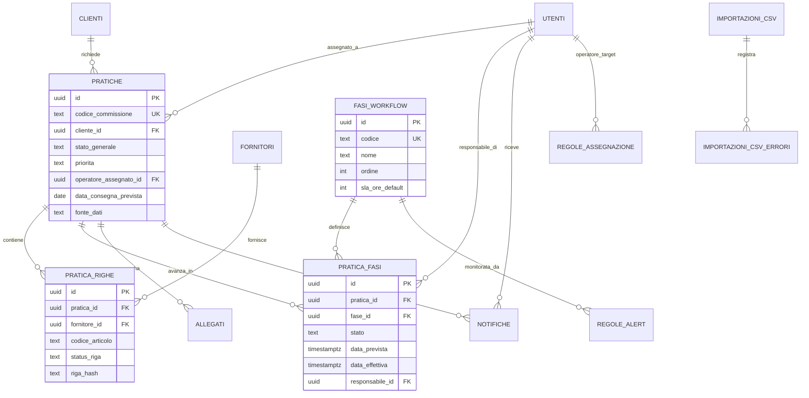

# 3. Schema del database

Schema completo, eseguibile, in `supabase/migrations/0001_init.sql` (tabelle), `0002_automazioni.sql` (trigger/regole) e `0003_viste_kpi.sql` (funzioni per la dashboard). Di seguito lo schema relazionale sintetico.

## 3.1 Diagramma entità-relazione (semplificato)

## 3.2 Tabelle principali (riepilogo)

- **utenti** — profilo applicativo (nome, ruolo admin/responsabile/operatore, attivo).
- **clienti** — anagrafica cliente, con `codice_esterno` predisposto per il matching futuro via API.
- **fornitori** — anagrafica fornitori (dal campo "Fornitore" del CSV).
- **fasi_workflow** — le 9 fasi operative configurabili (ricezione → chiusura), con SLA di default per fase.
- **pratiche** — la commissione di assistenza; chiave naturale `codice_commissione`.
- **pratica_righe** — dettaglio articoli/attività per pratica (mappa 1:1 le righe del CSV).
- **pratica_fasi** — stato di ogni fase per ogni pratica (una riga per pratica × fase).
- **storico_modifiche** — audit trail di ogni cambio campo rilevante (pratica, riga, fase).
- **allegati** — file caricati (foto, documenti), collegati a Supabase Storage.
- **regole_assegnazione** — regole configurabili per l'assegnazione automatica (es. A-C → Maria).
- **regole_alert** — soglie SLA configurabili (es. "presa in carico entro 24h").
- **notifiche** — notifiche generate per gli utenti (alert, escalation, promemoria).
- **importazioni_csv / importazioni_csv_errori** — log di ogni importazione con conteggi ed errori riga per riga.
- **log_attivita** — audit generale di sistema (login, modifiche, export).
- **configurazioni** — parametri di sistema modificabili da admin (key-value, es. `fonte_dati_attiva: "csv"|"api"`).

## 3.3 Note di progettazione

- Ogni tabella "di stato" (`pratiche`, `pratica_righe`, `pratica_fasi`) ha `created_at`/`updated_at` automatici via trigger.
- Il campo `riga_hash` su `pratica_righe` permette all'importatore di sapere, in O(1), se una riga è cambiata rispetto all'ultima importazione, senza confrontare campo per campo.
- Il campo `fonte_dati` su `pratiche` (`csv` | `api`) è la leva che permetterà, in futuro, di sapere quali pratiche sono già state migrate al nuovo connettore API.
- Row Level Security è abilitata sulle tabelle principali: operatori vedono solo le proprie pratiche, admin/responsabili vedono tutto.
