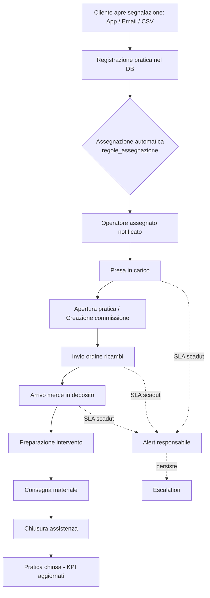
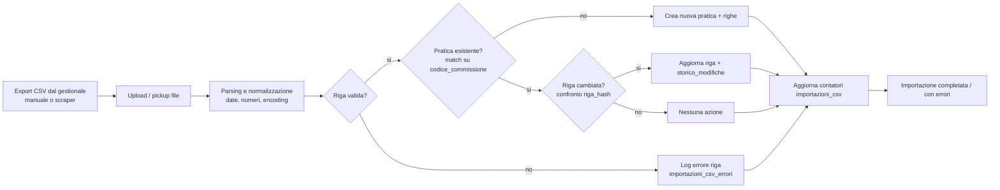
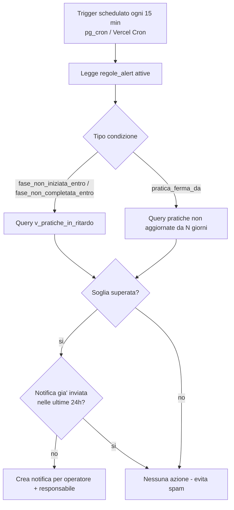
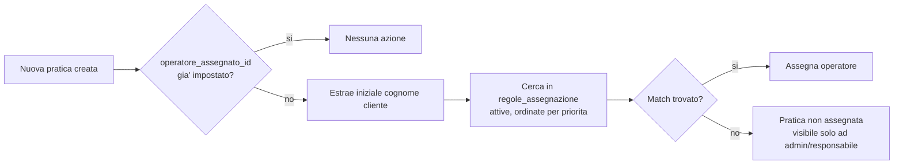

# 4. Diagrammi di flusso

## 4.1 Ciclo di vita di una pratica

## 4.2 Flusso di importazione CSV

## 4.3 Motore automazioni SLA (eseguito periodicamente)

## 4.4 Assegnazione automatica operatore

